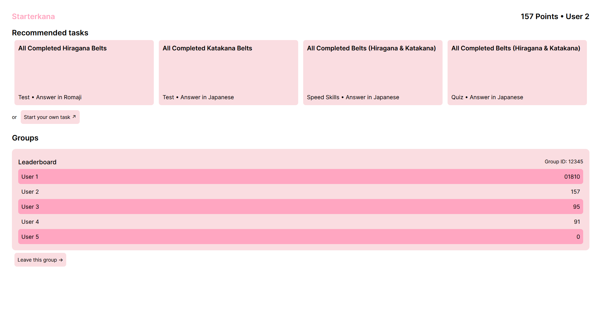
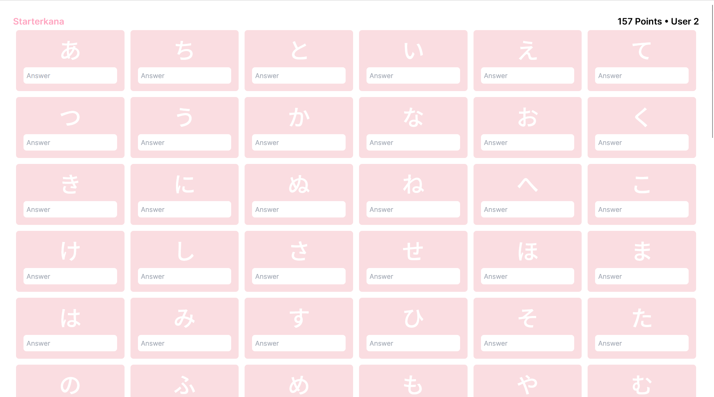

# Starterkana

This is the new version of Starterkana. The website is live [here](http://www.starterkana.onrender.com). If you wish to see the old version of starterkana, you can see it [here](http://www.starterkana.web.app)

Photos:




## Commands Available:

```
npm run dev
```

Starts a local development server.

```
npm run build
```

Builds the project into the dist folder.

```
npm run preview
```

Previews the project from the dist folder. Note that this command requires the project to be built.

### Starterkana was made with Vite, Svelte & tailwindcss.
If you encounter any issues, bugs, or have any feature reccomendations, please feel free to open an issue!
